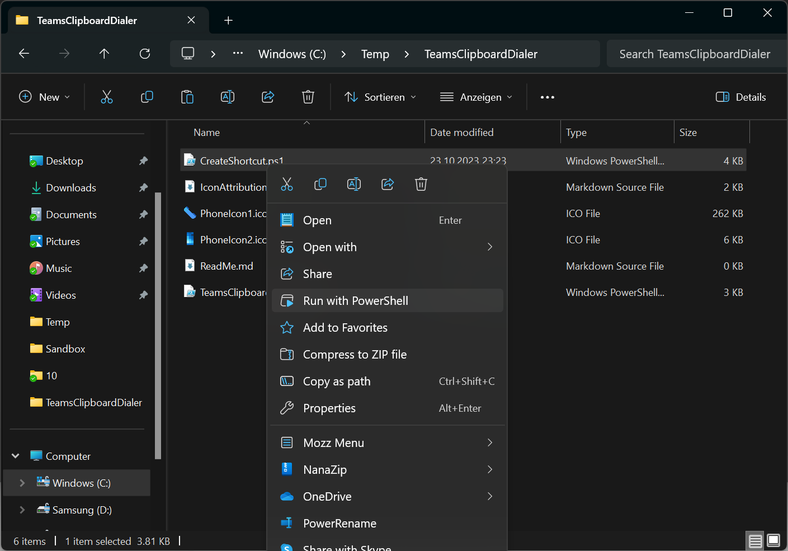
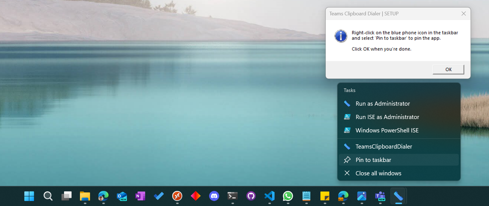
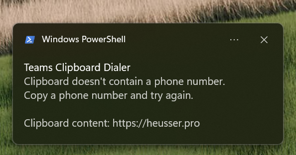
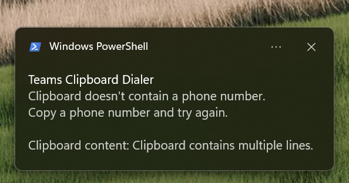

# Install

Navigate to the folder where you've saved the downloaded files. The folder must contain the following files:

- CreateShortcut.ps1
- TeamsClipBoardDialer.ps1
- PhoneIcon1.ico
- PhoneIcon2.ico

## Run the install script (CreateShortcut.ps1)

Run the script with PowerShell to install the files.

### PowerShell

```powershell
.\CreateShortcut.ps1
```

### Windows Explorer



## Pin to Taskbar



# Usage

Copy any phone number to the clipboard and either click the app on the taskbar or press the configured hotkey. (The default hotkey is **CTRL + SHIFT + F8**).

## Phone number in clipboard

If you have copied a valid phone number, Teams will open and you'll be asked if you want to start a call.


### Normalization rule behavior

It's generally advised to only copy a number and no other text. However, you don't need to worry about special characters like white spaces, brackets, hyphens, dots etc. Even illegal zeros which follow after an international prefix are removed. 

- Example: `+41 (0) 44-123.45.67` is changed to `+41441234567`

#### Copy multiple lines or multiple numbers

If your clipboard contains multiple lines, the script will extract the phone number. This only works if there are more digit chaacters than non-digit characters present.

Copying the following content will work:
```text
Martin:
+41441234567
```

Copying this won't work because there's more non-digit characters than digit characters present.
```text
Martin Heusser:
+41441234567
```

This is helps mistaking e.g. street numbers for 2 or 3 digit extension when an address is copied accidentally.
Copying this text won't dial `10`.
```text
Example Street 10
```

If your clipboard contains multiple numbers or contains more than 16 characters the numbers are disregarded.
Copying this text won't work. During the normalization, the numbers will be combined and then exceed the maximum length of 16 charcaters.
```text
+41431234567
+41441234567
```

#### Extension and emergency numbers

Copied numbers can be as short as 1 digit. This is because you can also dial internal extensions or emergency numbers.
The following numbers will all be callable:

```text
1
12
123
1234
```

If there is no leading `+` and the number is longer than 4 digits, a leading plus will be added.

- Example: `12345` is changed to `+12345`
- Example: `41441234567` is changed to `+41441234567`

#### International numbers

If a number is starting with two leading zeros, the script will convert them to E.164 by replacing them with a plus sign.

- Example: `0041441234567` is changed to `+41441234567`

#### National numbers

Numbers starting with `0``  will not be converted to E.164 because there's no way to know which country a number is from. The Teams built in dial plan will handle the normalization in this case.

- Example: `0441234567` will not be changed.

## No phone number in clipboard

If you didn't copy a phone number and have something else in the clipboard instead, you'll see an error message and your actual clipboard content.






# Buy me a coffee

If you like the work I've done on this app for the Teams community, please consider supporting me via https://github.com/sponsors/mozziemozz.