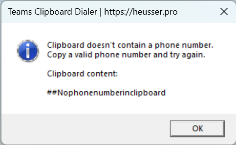

# Install

Navigate to the folder where you've saved the downloaded files. The folder must contain the following files:

- CreateShortcut.ps1
- TeamsClipBoardDialer.ps1
- PhoneIcon1.ico
- PhoneIcon2.ico

## Run the install script (CreateShortCut.ps1)

Run the script with PowerShell to install the files.

### PowerShell

```powershell
.\CreateShortcut.ps1
```

### Windows Explorer


## Pin to Taskbar


# Usage

Copy any phone number to the clipboard and either click the app on the taskbar or press the configured hotkey. (The default hotkey is **CTRL + SHIFT + F8**).

## Phone number in clipboard

If you have copied a valid phone number, Teams will open and you'll be asked if you want to start a call.


## No phone number in clipboard

If you didn't copy a phone number and have something else in the clipboard instead, you'll see an error message and your actual clipboard content.



# Buy me a coffee

If you like the work I've done on this app for the Teams community, please consider supporting me via https://github.com/sponsors/mozziemozz.